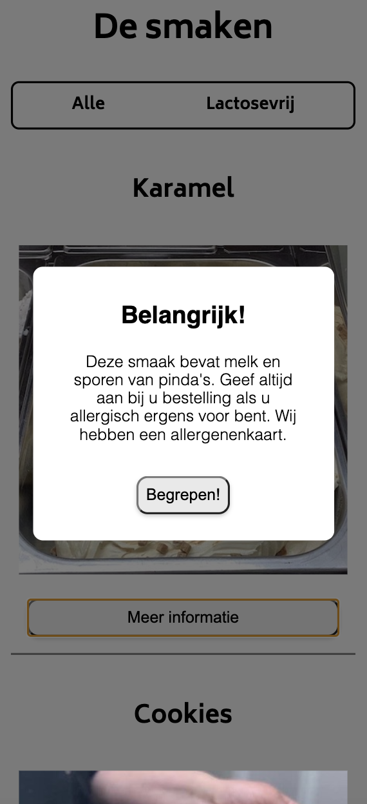
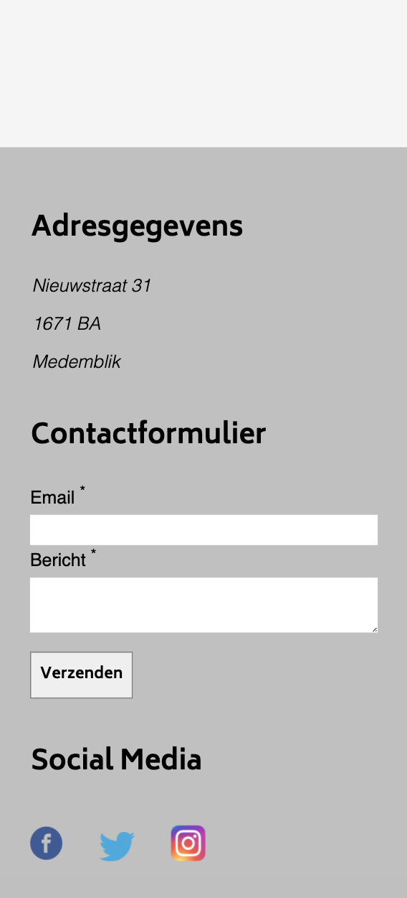
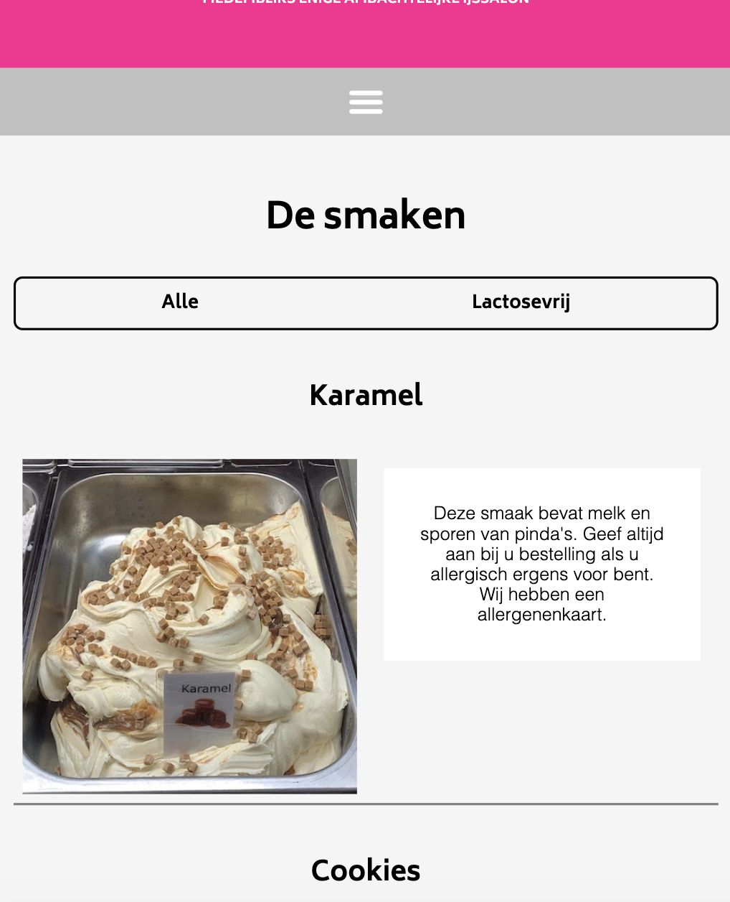
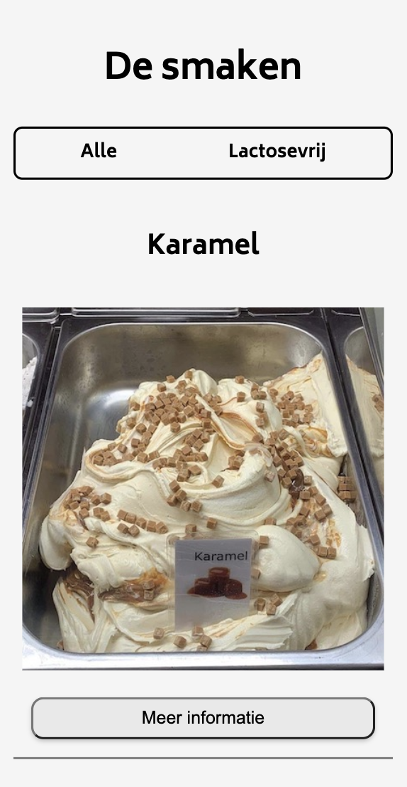
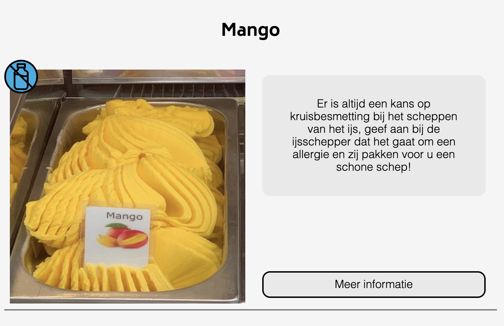
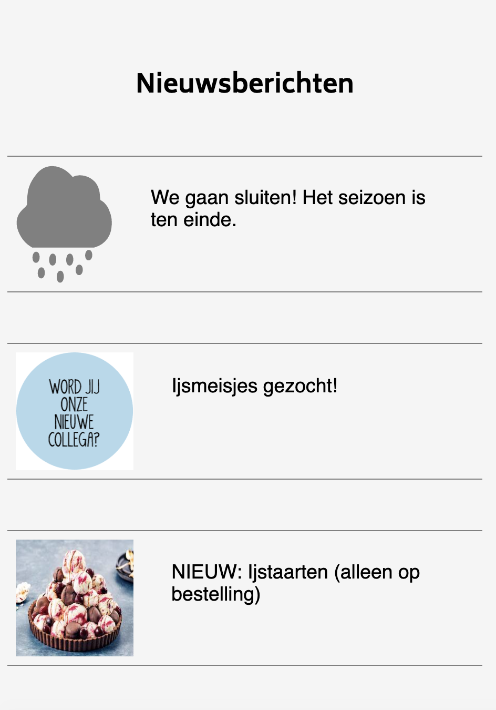
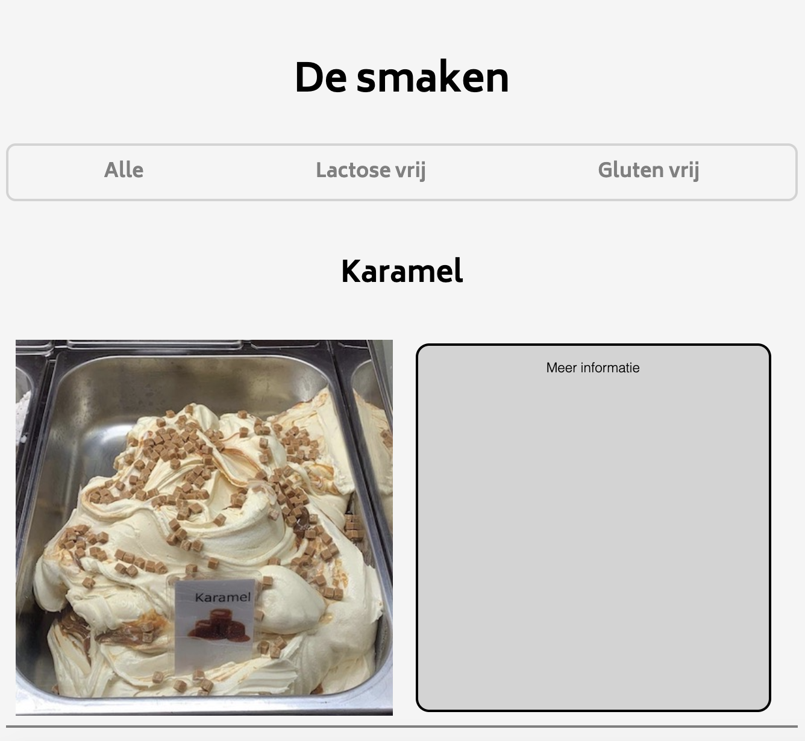

# Procesverslag
**Auteur:** Tessa Versteeg

Markdown cheat cheet: [Hulp bij het schrijven van Markdown](https://github.com/adam-p/markdown-here/wiki/Markdown-Cheatsheet). Nb. de standaardstructuur en de spartaanse opmaak zijn helemaal prima. Het gaat om de inhoud van je procesverslag. Besteedt de tijd voor pracht en praal aan je website.

## Bronnenlijst
1. https://www.youtube.com/watch?v=gWai7fYp9PY (animatie)
2. https://www.youtube.com/watch?v=XH5OW46yO8I (pop-up)
3. https://www.youtube.com/watch?v=MBaw_6cPmAw (pop-up)

## Eindgesprek (week 7/8)

Ik heb voor mijn gevoel heeeel veel uur in dit vak gestoken. Iedere keer lukte er wel iets niet maar door veel proberen is het uiteindelijk wel goed gekomen.

In mijn eindresultaat heb ik een laatste item toegevoegd namelijk de pop-up. Met maar een paar code javascript heb ik dat uiteindelijk na veel proberen en mislukken voor elkaar gekregen. Dit was het focuspunt waar ik nog aandacht aan wilden besteden. Ik wilde ook nog iets doen met animatie van de lactose en gluteniconen maar daar ben ik niet aan toegekomen.

**Screenshot(s):**

## Voortgang 3 (week 6)

Het gaat goed met mijn website. Ik ben bijna klaar, ik moet alleen nog een paar animaties toevoegen/maken. 

En ik wil bij de mobiele versie van de smaken pagina de 'meer informatie' knop animeren dat er een soort pop-up in het scherm komt van de allergieen en andere nodige informatie.

Ik vind zelf dat ik in deze 6 weken weer heel veel heb geleerd en dan vooral door de opdrachten van Sanne en de door Joost gegeven aanvullende lessen daarbij. Maar ook door zelf veel te oefenen en proberen in mijn code. 

**Screenshot(s):**

### Agenda voor meeting 2

Deze week hebben we met ons groepje besloten om naar de code van Bo te gaan kijken. Bo heeft een aantal display:grid probleempjes waar ze niet uitkomt. En ik denk dat het over het algemeen in deze fase misschien wel handig is om daar nogmaals goed naar te kijken.

Want met het responsive maken van onze sites is grid gewoon een hele sterke tool. Ik heb zelf voor de aanvang van deze les nog wat gespeeld met grid in mijn website. En dat is mij wel gelukt.

### Verslag van meeting 2
Na de meeting had ik vooral weer veel over grid geleerd. Het is toch echt een krachtige tool om te coderen.

## Voortgang 2 (week 5)

Het gaat eigenlijk best goed met het maken van mijn website. Ik heb de homepage zo goed als responsive, er zijn nog een paar kleine dingetjes zoals de nieuwsberichten die ik op desktop anders wil vormgeven maar daar heb ik wel vertrouwen in dat het gaat lukken. 

Ook heb ik een beetje geexpirimenteerd met SVG animeren. Ik heb het logo geanimeerd en een SVG van een regenwolk, nu lijkt het echt of het regent.

Ik heb nog steeds geen werkend hamburger menu, ik heb meerdere keren dingen geprobeerd maar het lukt me gewoon niet om het mooi te krijgen. Dus dat is iets wat ik tijdens het voortgangsgesprek deze week wel wil aankaarten.

En nog iets wat ik appart vind, is dat op de pagina van de smaken de afbeeldingen niet meeschalen met de pagina. Ik kan zo snel niet vinden waar dat aan ligt want ik heb hetzelfde gedaan als op de homepage en daar schaalt het wel mooi mee.

**Screenshot(s):**

### Agenda voor meeting 2

Wij hebben met ons groepje C even besproken waar we allemaal tegen aan lopen en dat is het hamburger menu werkend krijgen. En er zijn een aantal mensen die moeite hebben met responisve design van de navbar, dit samen is denk ik wel een goed idee om samen aan te werken en naar te kijken.

En zelf zit ik nog met het feit dat mijn smaken pagina niet responsive werkt, ik kan ook niet een twee drie zien waar dat aan ligt want ik heb hetzelfde gedaan als op de homepage.

### Verslag van meeting 2

Na deze meeting is mijn hamburger menu gefixt. We  hadden met het groepje eigenlijk allemaal het probleem dat we niet wisten hoe we dat moesten doen. Dat kwam ook doordat de stof van de eerste week over postion:absolute weer was weggezakt. Maar door samen gekeken te hebben ernaar snap ik het nu weer en denk ik oh ja zo moest het.

Wat is nu nog verder moet doen is het perfectioneren van de smaken pagina. En ik ga nog wat spelen met animaties denk ik.

## Voortgang 1 (week 3)

### Stand van zaken

Eigenlijk ging het namaken van mijn website wel goed. Ik heb vooral gekeken ook naar hoe ik de website mooier kon maken. Ik heb daarom ook wat dingen weg gelaten en dingen anders gedaan. 

Wel heb ik met de navigatie een hamburger menu, ik weet alleen niet zo goed hoe ik die werkend moet krijgen. Ik heb wel de website responsive dus op desktop zie je het menu gewoon in de balk. En op mobiel verdwijnt deze in een hamburger menu. Alleen moet ik dit nog met Javascript gaan animeren. 

Ik moet even opzoeken hoe ik dat moet gaan doen met CSS of met Javascript. Ik heb wel veel tutorials gekeken maar ik kom er niet uit.

**Screenshot(s):**

### Agenda voor meeting 1

Wij willen graag met ons groepje naar iedereen zijn website en code kijken en dan feedback geven dat vonden wij vorige les goed werken. 

Ook als we ergens niet uitkomen zoals ik met dat hamburger menu, dan willen we dat in het gesprek aankaarten en kijken of we elkaar kunnen helpen.

### Verslag van meeting 1

Ik vond het een nuttige meeting, we hebben naar de code van Shantalla en Muhammet gekeken. Niet naar die van mij maar ik vond dit juist wel interessant om samen naar de code van anderen te kijken. Ik heb actief meegedaan en heb daadwerkelijk veel geleerd.

Kris heeft een aantal keer iets gezegt over float, en zijn quote over het algemeen van deze meeting was: "Iewl float, Flexbox it is"

Flexbox is een krachtige tool om elementen te positioneren. Er zijn zoveel manieren om met flexbox dingen op z'n plek te krijgen. Dit heb ik ook gezien in de website van Muhammet. 

Ook in mijn website kan ik heel veel flexbox gebruiken om alles op z'n plek te krijgen.

Nog een ding dat ik geleerd heb ik het vishaakje. Als je die gebruikt kan je een specifiek element gaan stylen.

## Intake (week 1)

**Je startniveau:** Blauwe piste

**Je focus:** Responsive en ik vind de website lelijk dus ga ik de website mooier maken en het logo wil ik gaan proberen te animeren.

**Je opdracht:** Ik ga de website van de ijssalon waar ik werk namaken. De site is wat verouderd dus ik zie hier wel een uitdaging in om de website gelijk weer up to date te krijgen. Ik ga het eerst namaken en als dat lukt ga ik aanpassingen in de site doorvoeren. Dit is de link naar de site zoals het nu is- http://www.ijssalondongelato.nl

**Screenshot(s):**

 

**Breakdown-schets(en):**

