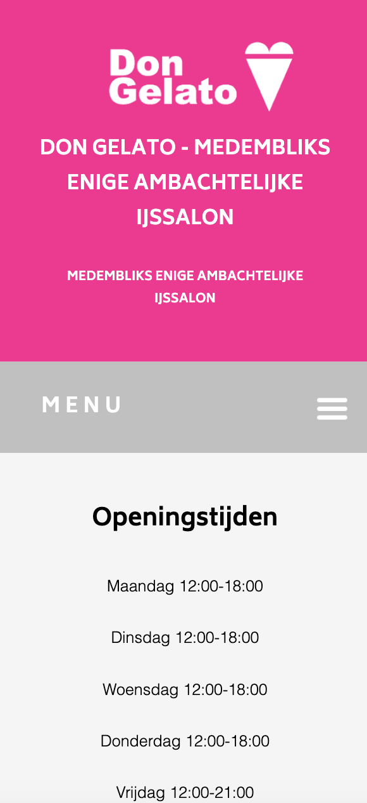
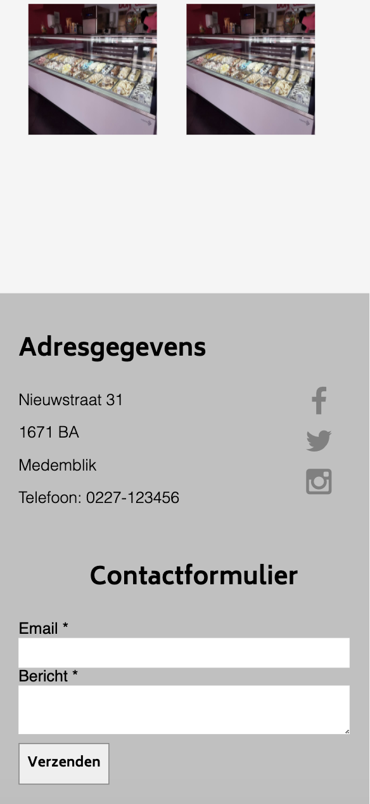
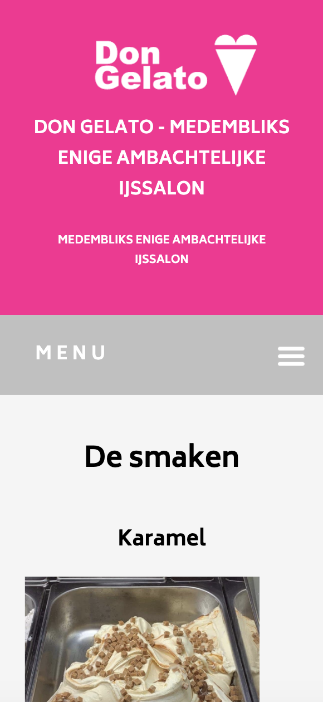

# Procesverslag
**Auteur:** Tessa Versteeg

Markdown cheat cheet: [Hulp bij het schrijven van Markdown](https://github.com/adam-p/markdown-here/wiki/Markdown-Cheatsheet). Nb. de standaardstructuur en de spartaanse opmaak zijn helemaal prima. Het gaat om de inhoud van je procesverslag. Besteedt de tijd voor pracht en praal aan je website.

## Bronnenlijst
1. -bron 1-
2. -bron 2-
3. -...-

## Eindgesprek (week 7/8)

-dit ging goed & dit was lastig-

**Screenshot(s):**

-screenshot(s) van je eindresultaat-

## Voortgang 3 (week 6)

-same as voortgang 1-

## Voortgang 2 (week 5)

-same as voortgang 1-

## Voortgang 1 (week 3)

### Stand van zaken

Eigenlijk ging het namaken van mijn website wel goed. Ik heb vooral gekeken ook naar hoe ik de website mooier kon maken. Ik heb daarom ook wat dingen weg gelaten en dingen anders gedaan. 

Wel heb ik met de navigatie een hamburger menu, ik weet alleen niet zo goed hoe ik die werkend moet krijgen. Ik heb wel de website responsive dus op desktop zie je het menu gewoon in de balk. En op mobiel verdwijnt deze in een hamburger menu. Alleen moet ik dit nog met Javascript gaan animeren. 

Ik moet even opzoeken hoe ik dat moet gaan doen met CSS of met Javascript. Ik heb wel veel tutorials gekeken maar ik kom er niet uit.

**Screenshot(s):**

### Agenda voor meeting

Wij willen graag met ons groepje naar iedereen zijn website en code kijken en dan feedback geven dat vonden wij vorige les goed werken. 

Ook als we ergens niet uitkomen zoals ik met dat hamburger menu, dan willen we dat in het gesprek aankaarten en kijken of we elkaar kunnen helpen.

### Verslag van meeting

Ik vond het een nuttige meeting, we hebben naar de code van Shantalla en Muhammet gekeken. Niet naar die van mij maar ik vond dit juist wel interessant om samen naar de code van anderen te kijken. Ik heb actief meegedaan en heb daadwerkelijk veel geleerd.

Kris heeft een aantal keer iets gezegt over float, en zijn quote over het algemeen van deze meeting was: "Iewl float, Flexbox it is"

Flexbox is een krachtige tool om elementen te positioneren. Er zijn zoveel manieren om met flexbox dingen op z'n plek te krijgen. Dit heb ik ook gezien in de website van Muhammet. 

Ook in mijn website kan ik heel veel flexbox gebruiken om alles op z'n plek te krijgen.

Nog een ding dat ik geleerd heb ik het vishaakje. Als je die gebruikt kan je een specifiek element gaan stylen.

## Intake (week 1)

**Je startniveau:** Blauwe piste

**Je focus:** Responsive en ik vind de website lelijk dus ga ik de website mooier maken en het logo wil ik gaan proberen te animeren.

**Je opdracht:** Ik ga de website van de ijssalon waar ik werk namaken. De site is wat verouderd dus ik zie hier wel een uitdaging in om de website gelijk weer up to date te krijgen. Ik ga het eerst namaken en als dat lukt ga ik aanpassingen in de site doorvoeren. Dit is de link naar de site zoals het nu is- http://www.ijssalondongelato.nl

**Screenshot(s):**

 

**Breakdown-schets(en):**

